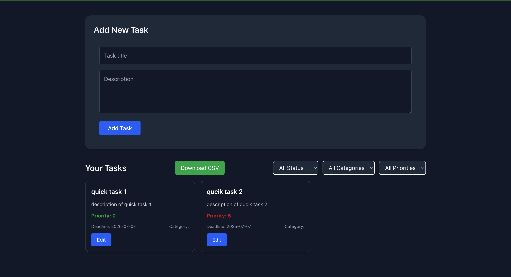
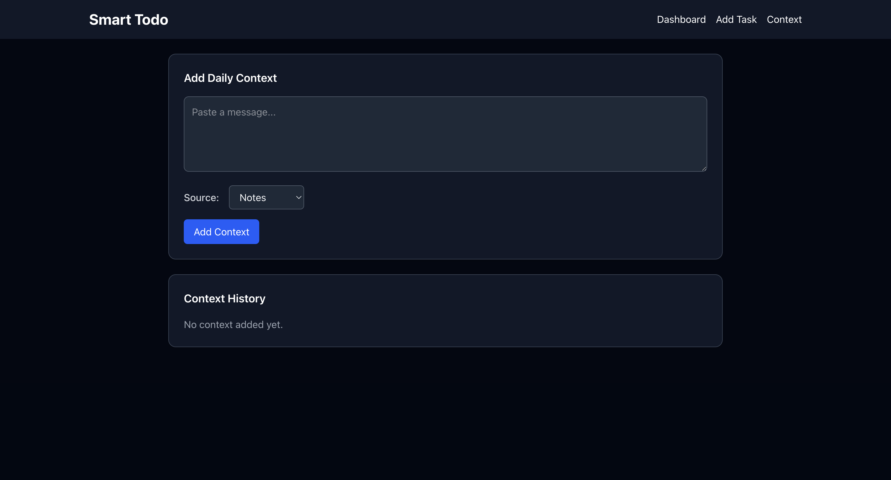
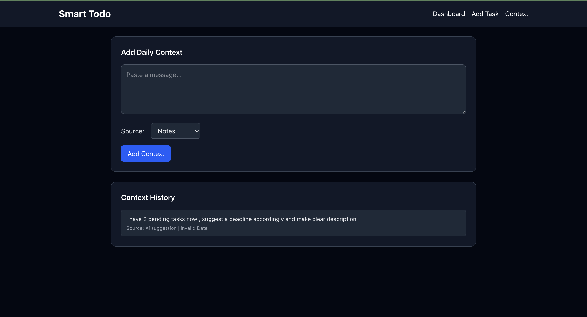
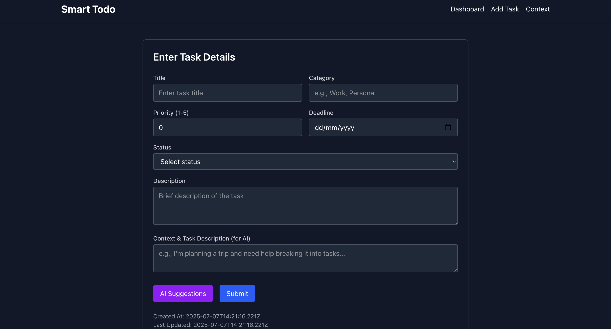
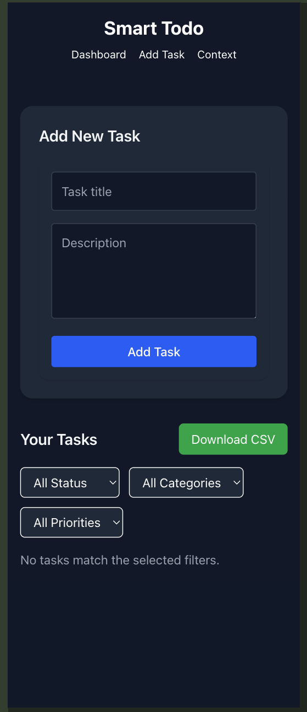
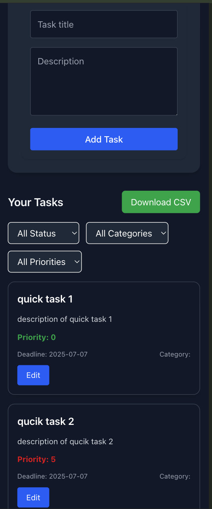
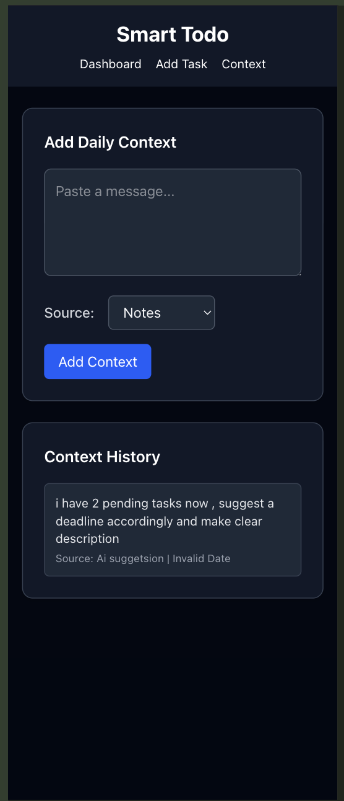
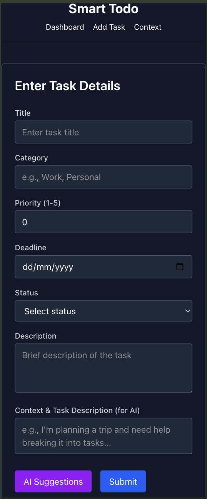

This is a Smart Todo FullStack Application Repo.
- Frontend: [Next.js]
- Backend: [Django]
- API Communication: REST 
- AI usage : LM stdio Mathstral 7B 

---

## Screenshots of the UI 

## 🗂️ Project Structure

root/                                    
├── backend/ # Django project directory  
│                                        
├── frontend/ # Next.js project directory  
│__ assets                                 

## Instructions to run the FE application:

->clone the Repo  
->change to the Front End folder  
-> run 'npm install'  
-> you will see a package.lock.json file  
-> run npm run dev  
-> you can access the application from http://localhost:3000  
-> you can access the Hosted Application at https://smart-todo-pied.vercel.app/  

## Instructions to run the BE application:

# API documentation:

# Sample data to test:
