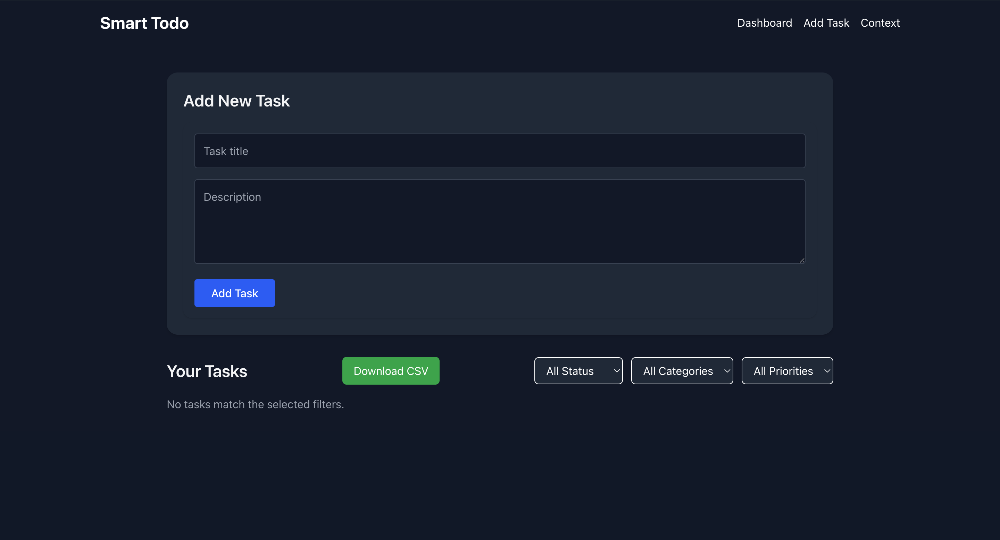
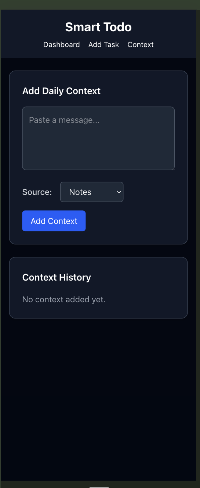

This is a Smart Todo FullStack Application Repo.
- Frontend: [Next.js]
- Backend: [Django]
- API Communication: REST 
- AI usage : LM stdio Mathstral 7B 

---

## Screenshots of the UI 

## 🗂️ Project Structure

root/
├── backend/ # Django project directory
│ 
├── frontend/ # Next.js project directory
│__ assets

instructions to run the FE application:
instructions to run the BE application:

API documentation:

sample data to test:
